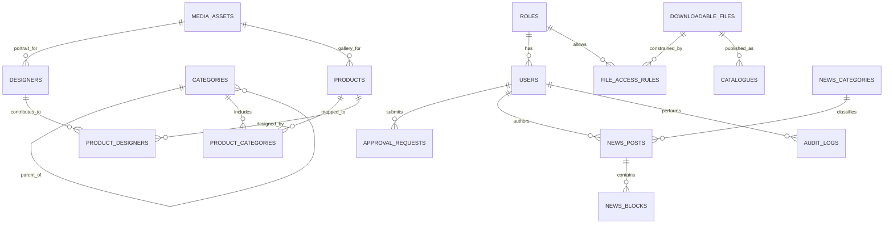
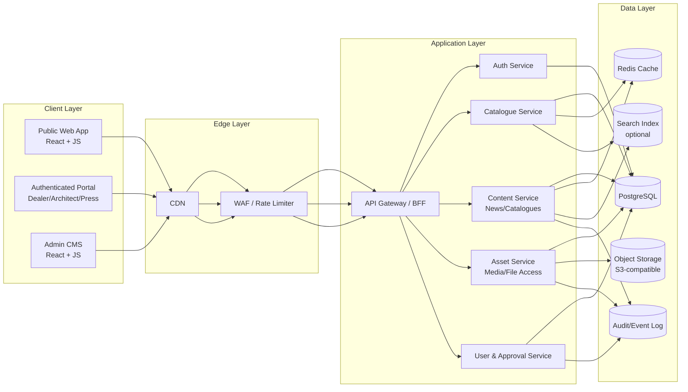
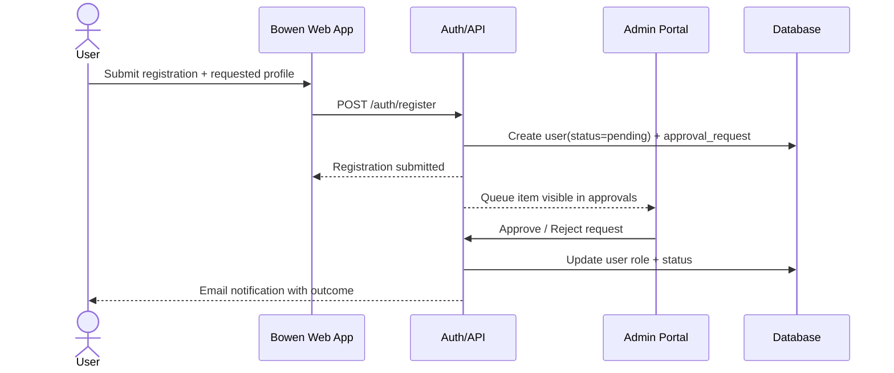
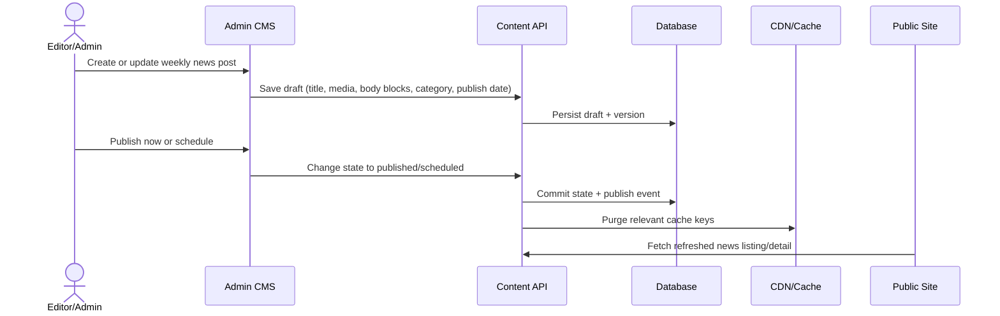
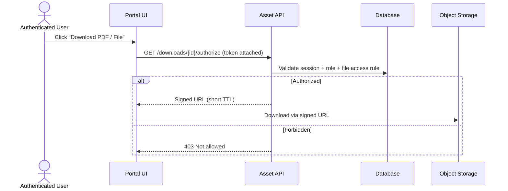

# Bowen Furniture Catalogue Platform

## 0) Source Pages Reviewed

Observed on February 13, 2026:
- https://www.minotti.com/en
- https://www.minotti.com/en/designers
- https://www.minotti.com/en/catalogues
- https://www.minotti.com/en/news
- https://www.minotti.com/en/collections/outdoor
- https://www.minotti.com/en/press-area
- https://www.minotti.com/it/register?userType=architetto

## 1) Benchmark Scan Summary (Minotti) - as observed on February 13, 2026

This section captures behaviors and structure to replicate at the UX-pattern level for Bowen.

### 1.1 Global navigation and menu behavior
- Top utility links include: `Login`, `Designers`, `Download Area`, `Catalogues`, `Contact us`.
- Multi-language switcher is globally visible.
- A large navigation pane/mega-menu groups content by domains:
  - `Products` (Indoor + Outdoor category trees)
  - `Materials`
  - `Collections`
  - `About Us`
  - `News & Media`
  - `Sales Network`
- Product taxonomy is deeply categorized.
  - Indoor categories observed:
    - Sofas
    - Chaise longue and Daybed
    - Armchairs
    - Accessories
    - Little armchairs and stools
    - Tables and Writing Desks
    - Coffee tables
    - Console tables
    - Bookcases and sideboards
    - Rugs
    - Beds
    - Night-tables
    - Bedwear
  - Outdoor categories observed:
    - Sofas
    - Chaise longue and Daybed
    - Sunloungers
    - Armchairs
    - Accessories
    - Little armchairs and stools
    - Tables
    - Coffee tables
    - Rugs
    - Bedwear
- Product listing pages expose filter controls (e.g., `View all`, `Designer`, `Certifications`) and load-more behavior.

### 1.2 Content model patterns
- Product detail pages include:
  - Image gallery
  - Designer attribution
  - Descriptive text
  - Technical features section
  - Download section (technical sheets, CAD/BIM/2D/3D where available)
  - Utility actions (`find a dealer`, `save in your selection`)
- Designers:
  - Designers index page
  - Individual designer profile pages with long-form biography/media
- Catalogues:
  - Dedicated page listing multiple catalog publications
  - PDF download actions
- News:
  - News hub with taxonomy filters and year filters
  - Load-more behavior for archives

### 1.3 Account model and gated access patterns
- Three clearly differentiated account profiles are present:
  - `Authorized Dealer`: access to Download Area, World of Materials, My Selection.
  - `Architect`: access to Download Area, World of Materials, My Selection.
  - `Press`: access to high-resolution image archive.
- Registration flow includes role/profile choice and appears to use manual approval (request submitted and awaiting approval).
- Password lifecycle policy appears in registration flow (12-month validity in observed registration copy).

### 1.4 Legal/compliance signal from benchmark
- The benchmark site explicitly states strict intellectual property protections for content and branding.
- For Bowen, implementation should reproduce interaction patterns and IA logic, but use Bowen-owned branding, assets, and content.

---

## 2) Product Goal for Bowen

Build a React + JavaScript online furniture catalogue for `Bowen` with:
- Luxury editorial UI direction inspired by benchmark patterns.
- Equivalent high-level menu and navigation-pane behavior.
- Modular data architecture for furniture, categories, designers, catalog PDFs, media, and news.
- Role-based account access for:
  - Authorized dealer (highest access)
  - Architect (materials + furniture access)
  - Press (photos only)
- Admin-friendly weekly news publishing and updates.

---

## 3) User Requirements

### 3.1 Public visitors
- UR-01: Browse Indoor and Outdoor collections through a multi-level navigation pane.
- UR-02: Discover furniture by category, designer, certifications, and collection/year filters.
- UR-03: View rich product detail pages with galleries and technical information.
- UR-04: Browse designer profiles and understand designer background.
- UR-05: Access public catalogues and download public PDFs where permitted.
- UR-06: Read news archive with category and year filters.

### 3.2 Registered users by profile
- UR-07: Sign up and sign in with profile-based access levels.
- UR-08: Authorized dealers can access all restricted downloads/materials and curated private areas.
- UR-09: Architects can access restricted materials and technical resources.
- UR-10: Press users can access only approved high-resolution photo assets.

### 3.3 Admin and content teams
- UR-11: Create/edit/publish weekly news quickly via CMS-like admin flows.
- UR-12: Upload and manage downloadable PDFs for catalogues and product documents.
- UR-13: Manage designer profiles and related assets.
- UR-14: Manage user approvals and role assignment with audit trail.

---

## 4) System Requirements

### 4.1 Core platform
- SR-01: Frontend must use React + JavaScript.
- SR-02: Backend must expose modular APIs for catalogue, assets, users/roles, and news.
- SR-03: Data layer must support relational entities and many-to-many mapping (products-categories, products-designers, assets-products, etc.).
- SR-04: File storage must support large media + PDF delivery with secure access controls.

### 4.2 Security and identity
- SR-05: Authentication via secure session/JWT with refresh strategy.
- SR-06: Role-based access control (RBAC) must gate endpoints and UI features.
- SR-07: Registration and approval workflow for protected profiles.
- SR-08: Download authorization checks before file delivery.

### 4.3 Admin operations
- SR-09: Admin UI for CRUD over products/categories/designers/news/catalogues/users.
- SR-10: Content workflow states (`draft`, `review`, `published`, `archived`) for news and optional product content.
- SR-11: Soft delete + versioning for critical content entities.

### 4.4 Delivery and runtime
- SR-12: CDN support for media and PDF distribution.
- SR-13: Observability stack (structured logs, metrics, error tracking, audit logs).
- SR-14: Backup and restore strategy for database and object storage.

---

## 5) Functional Requirements

### 5.1 Information architecture and navigation
- FR-01: Implement global top utility menu: Login, Designers, Download Area, Catalogues, Contact.
- FR-02: Implement navigation pane/mega-menu with major sections:
  - Products (Indoor + Outdoor trees)
  - Materials
  - Collections
  - About
  - News & Media
  - Sales Network
- FR-03: Navigation must be consistent on desktop and mobile (responsive panel behavior).

### 5.2 Catalogue and product discovery
- FR-04: Products listing supports category filters, designer filters, certification filters, and search.
- FR-05: Products listing supports pagination or load-more.
- FR-06: Product detail includes gallery, description, technical specs, designer attribution, related downloads.
- FR-07: Optional "save selection" feature for logged-in eligible roles.

### 5.3 Designers
- FR-08: Designers index page with portrait + name cards.
- FR-09: Designer detail page includes biography, media, and linked product collections.

### 5.4 Catalogues and downloadable files
- FR-10: Catalogues page lists publications grouped by type/year.
- FR-11: Each catalogue can expose metadata and PDF download action.
- FR-12: Product-level files supported: technical sheet, CAD/2D/3D/BIM, high-res images.
- FR-13: Access to downloads must be permissioned by role/content visibility rules.

### 5.5 News and editorial
- FR-14: News hub supports categories (e.g., shows/events, stores, products, videos, corporate) and year filters.
- FR-15: Admin can create, edit, schedule, and publish weekly news.
- FR-16: News cards support title, date, category, excerpt, hero image, body blocks, and gallery/video embeds.
- FR-17: News archive supports load-more/pagination.

### 5.6 Authentication, authorization, and account lifecycle
- FR-18: Sign-up flow includes profile type selection (`authorized dealer`, `architect`, `press`).
- FR-19: Registration requests enter approval queue before full access activation.
- FR-20: Sign-in, password reset, and secure password policy are required.
- FR-21: UI and API enforce role permissions consistently.
- FR-22: Admin can approve, reject, suspend, and change user roles.

### 5.7 Admin and governance
- FR-23: Admin dashboard provides content overview and pending approval tasks.
- FR-24: All sensitive admin actions (role changes, publication, delete) are audited.
- FR-25: Media manager supports tagging, asset reuse, and access-level classification.

---

## 6) Non-Functional Requirements

- NFR-01 (Performance): LCP < 2.5s on key public pages under typical broadband/mobile conditions.
- NFR-02 (Availability): 99.9% monthly uptime target for public site and API.
- NFR-03 (Scalability): Horizontal API scaling; object storage-backed media growth without schema rewrite.
- NFR-04 (Security): OWASP Top 10 controls, rate limiting, secure headers, encryption in transit and at rest.
- NFR-05 (Privacy/Compliance): GDPR-ready consent and privacy policy surfaces; auditability for account approvals.
- NFR-06 (Access Control): Strict RBAC and deny-by-default for protected resources.
- NFR-07 (Accessibility): WCAG 2.1 AA baseline for public and admin UI.
- NFR-08 (Maintainability): Modular domain services with clear ownership and test coverage.
- NFR-09 (Observability): Centralized logs, alerts on auth failures/error spikes, download access anomaly monitoring.
- NFR-10 (Content Ops): Weekly news update should be executable by non-developer staff in < 30 minutes.

---

## 7) Proposed Information Architecture for Bowen

### 7.1 Primary site map
- Home
- Products
  - Indoor
    - Sofas
    - Chaise longue and Daybed
    - Armchairs
    - Accessories
    - Little armchairs and stools
    - Tables and Writing Desks
    - Coffee tables
    - Console tables
    - Bookcases and sideboards
    - Rugs
    - Beds
    - Night-tables
    - Bedwear
  - Outdoor
    - Sofas
    - Chaise longue and Daybed
    - Sunloungers
    - Armchairs
    - Accessories
    - Little armchairs and stools
    - Tables
    - Coffee tables
    - Rugs
    - Bedwear
- Designers
- Materials
- Collections
- News & Media
- Catalogues
- Download Area (role-gated where needed)
- Contact
- Sign in / Register
- Admin (restricted)

### 7.2 Role-to-area access matrix

| Area / Capability | Public | Authorized Dealer | Architect | Press | Admin |
|---|---:|---:|---:|---:|---:|
| Browse public catalogue pages | Yes | Yes | Yes | Yes | Yes |
| Download public PDFs | Yes | Yes | Yes | Yes | Yes |
| Access protected technical files | No | Yes | Yes | No | Yes |
| Access materials world | No | Yes | Yes | No | Yes |
| Access hi-res press photo archive | No | Optional | Optional | Yes | Yes |
| Manage news/products/users | No | No | No | No | Yes |

---

## 8) Modular Database Design

### 8.1 Modules
- `catalog_module`
  - categories, collections, products, product_variants, certifications
- `designer_module`
  - designers, designer_biographies, designer_media
- `asset_module`
  - media_assets, downloadable_files, file_access_rules
- `content_module`
  - news_posts, news_categories, news_blocks, tags
- `identity_module`
  - users, roles, permissions, user_profiles, approval_requests, sessions
- `ops_module`
  - audit_logs, publish_events, scheduled_jobs

### 8.2 Core entities (high-level)
- `users(id, email, password_hash, status, role_id, created_at, updated_at)`
- `roles(id, code, name)` -> dealer, architect, press, admin
- `approval_requests(id, user_id, requested_role, state, reviewer_id, reviewed_at, notes)`
- `categories(id, name, slug, parent_id, domain)` where domain = indoor/outdoor
- `products(id, sku, name, slug, description, status, collection_id, visibility, created_at, updated_at)`
- `product_categories(product_id, category_id)`
- `designers(id, name, slug, short_bio, long_bio, portrait_asset_id)`
- `product_designers(product_id, designer_id)`
- `catalogues(id, title, type, year, cover_asset_id, pdf_file_id, visibility)`
- `news_posts(id, slug, title, excerpt, status, publish_at, category_id, author_id)`
- `news_blocks(id, post_id, block_type, payload_json, sort_order)`
- `media_assets(id, type, mime, path, width, height, alt_text, metadata_json)`
- `downloadable_files(id, title, file_type, path, size_bytes, checksum, visibility)`
- `file_access_rules(id, file_id, role_id, allow_download)`
- `audit_logs(id, actor_user_id, action, target_type, target_id, metadata_json, created_at)`

### 8.3 ER diagram (logical data model)

---

## 9) Logical View Diagram (system components)

---

## 10) Process View Diagrams

### 10.1 Registration, approval, and role activation

### 10.2 Weekly news publishing workflow

### 10.3 Protected file download flow (role-gated)

---

## 11) Assumptions and Constraints

- AC-01: Bowen will use original branding, original assets, and original copy.
- AC-02: We mirror navigation patterns and functional behavior, not copyrighted visual assets/content.
- AC-03: Manual approval workflow is required for protected account types.
- AC-04: News updates are expected weekly and managed by non-developer admins.

---

## 12) Clarifying Questions Before Implementation

1. Visual direction: Should we create a close structural match to Minotti interactions but with a distinct Bowen visual identity (recommended), or attempt near-identical styling?
2. Backend stack: Do you prefer `Node.js + Express`, `Node.js + NestJS`, or another backend framework?
3. Database: Is `PostgreSQL` acceptable for the primary relational database?
4. File storage: Should PDFs and images be stored in AWS S3 (or S3-compatible storage) from day one?
5. Admin scope: Do you want a custom admin panel in React, or should we integrate a headless CMS (e.g., Strapi/Sanity) for faster news/content operations?
6. Account approval: Who approves signups (single super-admin or multiple reviewers), and do you need email notifications for approvals/rejections?
7. Role permissions: Should Authorized Dealer also include Press photo access, or keep Press-only photos strictly isolated?
8. Languages: Is v1 English-only, or do you want multilingual content and localization support now?
9. Catalogues visibility: Which catalogue PDFs are public vs. role-restricted?
10. News workflow: Do you need scheduled publishing (date/time) and unpublishing, or only immediate publish/unpublish?
11. Search: Should we start with database search only, or include full-text search engine support in v1?
12. Hosting target: Do you already have deployment targets (e.g., Vercel + AWS, self-hosted VPS, Docker/Kubernetes)?
13. Compliance: Any mandatory legal/compliance requirements beyond privacy policy/cookie consent (e.g., specific regional requirements)?
14. Timeline: Do you want an MVP first (core catalogue + auth + news) followed by phase 2 enhancements, or a single full-scope delivery?

## 13) Clarifications

1. Visuals & Design: Create a close structural match to Minotti interactions but with destinct visual identity of a new brand Bowen. Bowen is a Georgian furniture company so UX should be available both in Georgian (default) and English (language selector should be visible in a top bar menu similarly to Minotti website). use noto serif georgian font.

2. use node.js + NestJS for backend stack and optimize for speed
3. use postgreSQL for database
4. store pdf/pictures in AWS S3 but also keep them in their original format in this repo for simple access
5. I want a custom admin panel with very simple and fast ui don't try to incorporate fancy visuals optimize on functionality only. provide a admin user guide
6. account approval is performed by the admin in admin panel, multiple people can access admin panel. we can add email notifications in the future (note it down in todo list)
7. Authorized dealer should have access to everything except admin operations
8. languages: Georgian and English. more can be added later - is an item for todo list
9. catalogues should have their own indicator of visibility in the db and appear corresponding to the visibility and the account access
10. only immediate publishing for now. add schedules publishing feature to todolist
11. search for now should focus on searching for furniture items or categories or keywords. it must be very fast. add possible improvments to search to todo
12. Design for hosting on a physical machine maintained by the company that will run 24/7. give hardware suggestions that will optimize for responsiveness across Georgia and nearby regions.
13. No special complience requirments for now. this is in test phase. add possibility of needing extra complience requirments to todolist.
14. create a functional mvp with placeholder items in db that can be hosted locally and maybe from github pages.